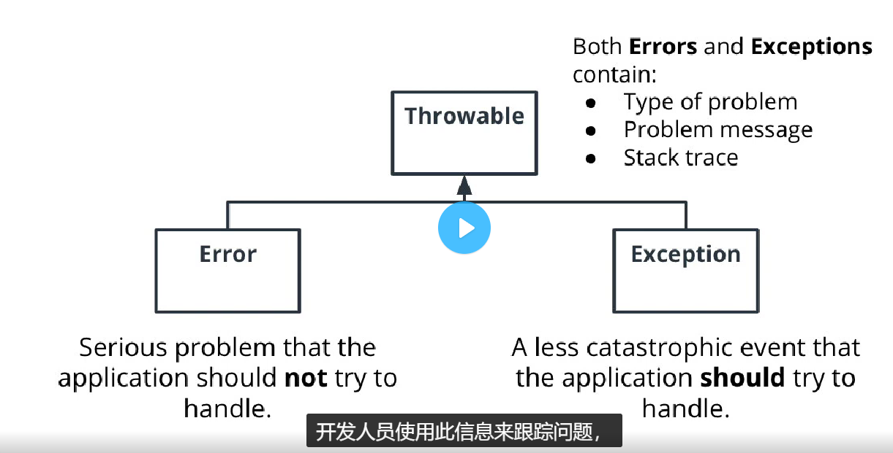
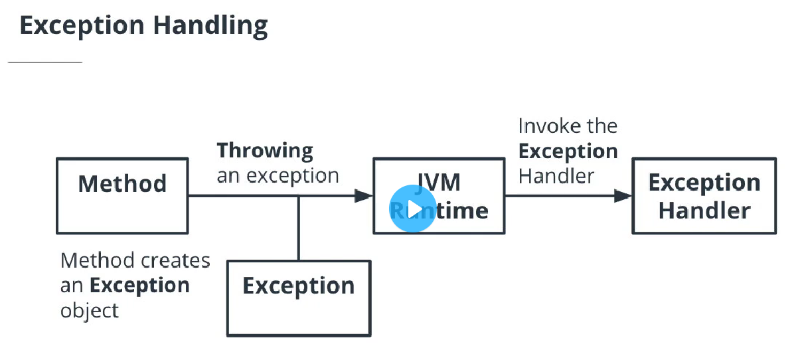

## 异常

#### Error和Exception两个类都是Throwable的子类，Error和Exception都包含：
- type of problem
- problem message
- stack trace
### 抛出异常
> 当方法中发生错误时，该方法会：①创建一个Exception对象。②接下来，该方法将异常传递给 JVM 运行时系统。

### 在 Java 中有两种不同类型的异常：
> catch已检查的异常将在编译时被捕获，并且在它们处于块中或被抛出之前不允许构建代码 。编译器不检查未检查（或运行时）异常。
1. 未经检查的异常
- 未经检查的异常是编译器未知的异常。
- 因为这些异常只有在运行时才知道，所以也称为运行时异常。
- 它们是编程错误的结果，通常是算术错误（例如被 0 除）。
- 当我们预计方法的调用者无法从异常中恢复时，使用未经检查的异常。
2. 检查异常
- 编译器知道已检查的异常。
- 如果我们正在调用一个可能会抛出已检查异常的方法，则必须对其进行处理（否则我们会从编译器中得到一个错误）。
- 当我们期望方法的调用者可以从异常中恢复时，使用已检查的异常。
```java
try {
    read();
}
catch (FileNotFoundException ex){
    ex.getLocalizedMessage();
}
finally {
}
```

## 枚举
> 枚举是一种特殊的常量数据类型，允许从枚举列表中设置变量。

- 枚举是一个类
- 在 Java 中，枚举的声明定义了一个类。此类可以存在于另一个类中或作为独立类存在。

```java
// 创建枚举
enum Stoplight {
  RED,
  YELLOW,
  GREEN
}
// 分配变量myStopLight
// 接下来，我们将使用枚举分配一个变量RED。

Stoplight myStoplight = Stoplight.RED;

// 在类中定义枚举
// 我们还可以从类内部创建一个枚举：
public class Main {
  enum StopLight {
    RED,
    YELLOW,
    GREEN
  }

  public static void main(String[] args) {
    StopLight myStoplight = Stoplight.RED; 
    System.out.println(myStoplight);
  }
}
```
## Scanner
### 示例 1
我们可以使用该类Scanner从命令行获取输入。为此，我们实例化一个扫描仪对象，传入System.in：

```
Scanner scanner = new Scanner(System.in);
```
示例 2
在此示例中，我们使用该nextLine方法返回输入的整行：
```
Scanner scanner = new Scanner("This is a line");
System.out.println(scanner.nextLine());
```
输出：
```
This is a line
```
示例 3
在下一个示例中，我们将使用该next方法来读取第一个标记。该next方法查找并返回下一个完整的标记。
```
Scanner scanner = new Scanner("This is a line");
System.out.println(scanner.next());
```
输出：
```
This
```
例 4
在最后一个示例中，我们在循环中使用该hasNext()方法while来确定调用下一个方法是否安全。我们只想在知道有可用令牌时调用下一个方法。

注意：默认情况下，扫描器通过空格标记输入。假设我们有一个包含以下文本的字符串"One Two Three"。文本将被标记为三个单独的标记"One"，"Two"和"Three"。
```
Scanner scanner = new Scanner("This is a line");

while(scanner.hasNext()) {
    System.out.println(scanner.next());
}
```
输出：
```
This
is
a
line
```

**其他资源**

Java 还有两个其他类:BufferedReader和Console，可用于从命令行读取用户输入。如果您想了解更多信息，可以查看这篇关于从控制台读取用户输入的三种方法的文章。https://www.codejava.net/java-se/file-io/3-ways-for-reading-input-from-the-user-in-the-console

## Dates 和 Calendar

## 正则表达式 (RegEx)

## 高级String